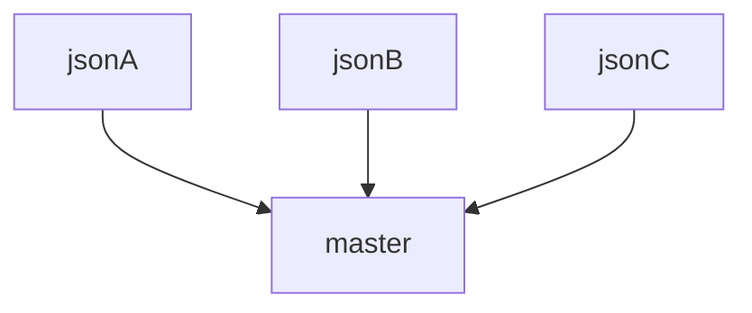

# obj-assembler
--------
[](https://github.com/jacklehamster/obj-assembler/actions/workflows/codeql-analysis.yml)

[](https://github.com/jacklehamster/obj-assembler/actions/workflows/pages/pages-build-deployment)

[](https://badge.fury.io/js/@dobuki%2Fobj-assembler)


--------
### Basic usage:

ObjAssembler is meant mainly to build complex JSON objects out of multiple JSON files. Commonly, you have one master JSON files that will be composed of multiple objects. Rather than have one large file, you can take pieces of them and put them into separate file.

For instance, to achieve the following:



Have your master file as follow:

`master`:
```json
{
  "componentA": {
    "type": "json",
    "src": "jsonA.json"
  },
  "componentB": {
    "type": "json",
    "src": "jsonB.json"
  },
  "componentC": {
    "type": "json",
    "src": "jsonC.json"
  }
}
```

Then fill each child jsons with content.

`jsonA`:
```json
{
   "fieldA": 123
}
```

`jsonB`:
```json
{
   "fieldB": "this is content B"
}
```

`jsonC`:
```json
["a", "b", "c"]
```

Compose the JSON using the code below:

```typescript
import Assembler from "obj-assembler"

const masterJSON = loadJsonFile("master.json"); //  masterJSON should be an object.

const assembler = new Assembler();
assembler.assemble(masterJSON);
```

This will result in the following JSON:
```json
{
  "componentA": {
      "fieldA": 123
  },
  "componentB": {
   "fieldB": "this is content B"
  },
  "componentC": ["a", "b", "c"]
}
```

See below for more advance usage.

## Advanced usage readme:

[link to usage](public/doc/usage.md)


## Demo

[demo](https://jacklehamster.github.io/obj-assembler/public/)

